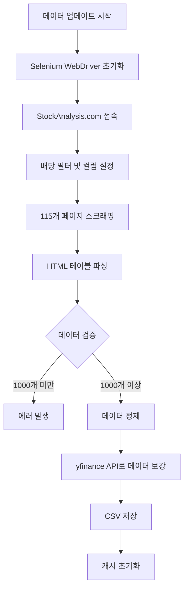
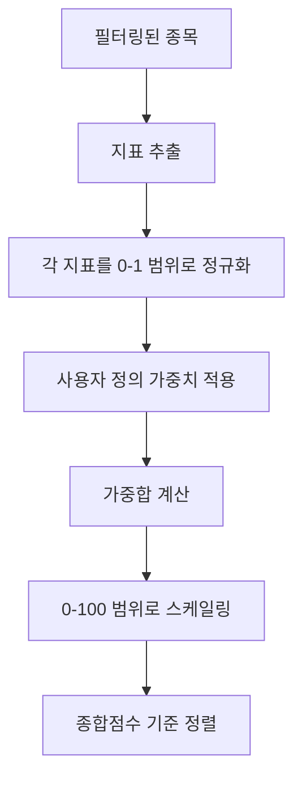
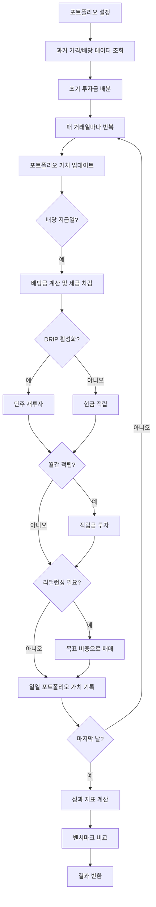

# 배당주 분석 플랫폼


배당주 스크리닝, 개별 종목 분석, 포트폴리오 백테스트를 제공하는 웹 기반 분석 도구입니다.

---

## 목차

- [설치 및 실행](#설치-및-실행)
- [웹 사용법](#웹-사용법)
  - [홈: 데이터 관리](#홈-데이터-관리)
  - [고배당 스크리너](#고배당-스크리너)
  - [배당성장 스크리너](#배당성장-스크리너)
  - [종목 상세분석](#종목-상세분석)
  - [포트폴리오 백테스트](#포트폴리오-백테스트)
- [기술 문서](#기술-문서)

---

## 설치 및 실행

### 설치
```bash
pip install -r requirements.txt
```

### 실행
```bash
streamlit run app.py
```

브라우저에서 `http://localhost:8501` 자동 오픈

### 최초 실행 시
1. 사이드바에서 **"크롤링으로 최신 데이터 수집"** 선택
2. **"데이터 업데이트 시작"** 버튼 클릭 (3-5분 소요)
3. 완료 후 자동으로 데이터 로드됨

---

# 웹 사용법

## 홈: 데이터 관리

### 데이터 소스 선택 (사이드바)

**1. 기존 데이터 사용 (빠름)**
- 저장된 CSV 파일에서 즉시 로드
- 일상적인 분석에 사용
- 마지막 업데이트 시간 표시

**2. 크롤링으로 최신 데이터 수집 (3-5분)**
- StockAnalysis.com에서 실시간 스크래핑
- 진행 상황 표시
- 주간/월간 데이터 갱신 시 사용

### 데이터셋 보기

메인 화면에 1,000개+ 배당주 데이터 표시:
- **Symbol**: 티커 심볼 (예: AAPL)
- **Div. Yield**: 배당수익률 (%)
- **Div. Growth 5Y**: 5년 배당성장률 (CAGR)
- **Years**: 연속 배당 지급 연수
- **Payout Ratio**: 배당성향
- **Market Cap**: 시가총액
- **Sector/Industry**: 섹터/산업
- **5Y/10Y Yield Diff**: 과거 평균 대비 현재 수익률 차이 (밸류에이션 지표)

**사용법**:
- 컬럼 헤더 클릭으로 정렬
- 마우스 오버 시 각 지표 설명 툴팁 표시
- 전체 데이터 스크롤 탐색

---

## 고배당 스크리너

**목적**: 높은 배당수익률 종목 찾기

### 필터 설정

**배당 지표**:
- **최소 배당수익률**: 0-15% 범위에서 선택 (기본값 3.5%)
- **배당성향 범위**: 지속가능성 필터링 (기본값 20-80%)
- **최소 연속배당 연수**: 안정성 지표 (기본값 5년)
- **최소 1년 배당성장률**: 최근 성장세 (기본값 1%)
- **최소 5년 배당성장률**: 장기 성장세 (기본값 1%)

**분류 필터**:
- **섹터**: Technology, Healthcare 등 다중선택
- **시가총액**: Mega/Large/Mid/Small/Micro/Nano-cap 선택

### 가중치 조정

스코어링 가중치를 슬라이더로 조정 (합계 100%):
- **배당수익률**: 50% (기본값 - 수익률 우선)
- **연속배당 연수**: 20%
- **5년 CAGR**: 10%
- **1년 성장률**: 10%
- **배당성향**: 10%

**활용법**: 수익률을 최우선으로 하려면 배당수익률 가중치를 80%로 상향 조정

### 결과 확인

**차트**:
1. **Top 10 종목 막대 차트**: 종합점수 기준 상위 종목
2. **수익률 vs 연수 버블차트**: 크기가 클수록 높은 점수
3. **배당수익률 분포**: 히스토그램

**내보내기**:
- 상위 50개 종목 테이블 표시
- CSV 다운로드 버튼으로 엑셀 분석 가능

---

## 배당성장 스크리너

**목적**: 배당 성장세가 강한 종목 찾기

### 고배당 스크리너와의 차이점

**필터 기본값** (성장 중심):
- 최소 수익률 낮춤 (2% vs 3.5%) - 현재 수익률보다 성장 중시
- 최소 성장률 높임 (5% vs 1%) - 성장 모멘텀 필수

**가중치** (성장 최적화):
- **5년 CAGR**: 35% (최우선 - 장기 성장)
- **1년 성장률**: 20% (최근 모멘텀)
- **배당수익률**: 25%
- **연속배당 연수**: 10%
- **배당성향**: 10%

### 결과 확인

**차트**:
1. **수익률 vs 5년 CAGR**: 성장과 수익률 트레이드오프 시각화
2. **Top 10 성장주**: 종합점수 상위 종목
3. **5년 성장률 분포**: 성장률 분포도

**활용 예시**: 30대 투자자가 현재 수익률 1%대지만 연 15% 배당성장하는 Visa, Microsoft 같은 종목 발굴

---

## 종목 상세분석

**목적**: 개별 종목 심층 분석

### 종목 선택
드롭다운에서 종목 선택 → Yahoo Finance 데이터 자동 로드

### 주요 지표 패널

**재무 건전성**:
- **FCF/배당금 비율**: 잉여현금흐름 커버리지 (>1.0 = 지속가능)
- **부채비율**: 재무 레버리지 (낮을수록 안전)
- **ROE**: 자기자본이익률 (높을수록 우수)

**배당 지표**:
- 배당수익률, 연간 배당금, 배당성향
- 연속배당 연수, 1년/5년 성장률

### 탭별 분석

**탭 1: 가격 및 수익률 이력**

**주가 차트**:
- 기간 선택: 1년/3년/5년/10년/전체
- EMA (지수이동평균) 오버레이
- 인터랙티브 줌/팬/호버 툴팁

**배당수익률 차트**:
- 역사적 수익률 추이
- 통계 요약 (평균, 중앙값, 현재)
- **활용법**: 현재 수익률이 평균보다 높으면 저평가 신호

**탭 2: 배당 이력**

**예정 배당**:
- 다음 배당락일 (이 날까지 매수해야 배당 수령)
- 다음 지급일

**과거 배당**:
- 최근 20회 배당 지급 내역 테이블
- 연간 배당금 막대차트
- **활용법**: 꾸준한 성장 또는 삭감/중단 여부 파악

**탭 3: 기업 정보**

- 섹터/산업 분류
- 시가총액, 직원 수, 거래소
- 웹사이트 링크
- 사업 설명
- **활용법**: 비즈니스 모델 이해 및 포트폴리오 섹터 다각화 평가

---

## 포트폴리오 백테스트

**목적**: 과거 데이터로 포트폴리오 전략 시뮬레이션

### 1단계: 포트폴리오 구성

**종목 선택**:
- 최대 20개 종목 선택 (다중선택 드롭다운)

**배분 방식**:
1. **동일 비중**: 각 종목 균등 배분 (5개 종목 = 각 20%)
2. **사용자 지정**: 각 종목별 비중 수동 입력 (합계 100% 필수)
3. **배당수익률 비중**: 수익률에 비례 배분
4. **시가총액 비중**: 시총에 비례 배분

### 2단계: 백테스트 설정

**기간**:
- 시작일/종료일 선택 (2000년~현재)
- 권장: 최소 5년 이상 (통계적 유의성)

**투자 설정**:
- **초기 투자금**: $1,000 ~ $10,000,000 (기본값 $10,000)
- **월간 추가투자**: $0 ~ $100,000 (기본값 $0)
  - 적립식 투자 시뮬레이션

**DRIP 설정**:
- **DRIP 활성화**: 배당금 자동 재투자 켜기/끄기
- **DRIP 수수료**: 0-2% (기본값 0%)
- 단주(소수점) 매수 지원

**세금 설정**:
- **적격배당 세율**: 0-40% (기본값 15% - 대부분 미국 주식)
- **일반배당 세율**: 0-50% (기본값 22% - REITs 등)
- **장기 양도소득세**: 0-40% (기본값 15% - 1년 이상 보유)

**리밸런싱**:
- **빈도**: 안함/월간/분기/반기/연간
- **수수료**: 0-2% (기본값 0.1%)
- **편차 임계값**: 1-20% (기본값 5% - 목표 비중에서 이만큼 벗어나면 리밸런싱)

### 3단계: 성과 지표 확인

**수익률 지표**:
- **최종 자산가치**: 종료일 기준 포트폴리오 가치
- **총 수익률**: 초기 투자 대비 수익률 (%)
- **연평균 수익률**: CAGR
- **벤치마크 대비**: S&P 500(SPY) 대비 초과 수익

**배당 소득**:
- **총 배당금**: 누적 배당 수령액
- **연간 배당소득**: 현재 기준 연간 배당 수령액

**리스크 지표**:
- **연간 변동성**: 수익률 표준편차 (낮을수록 안정적)
- **샤프 비율**: 위험 조정 수익률 (높을수록 우수)
- **소르티노 비율**: 하방 위험 조정 수익률
- **최대 낙폭**: 최고점 대비 최대 하락폭 (낮을수록 안전)

**시장 지표**:
- **베타**: 시장 상관계수 (1.0 = 시장과 동일)
- **알파**: 기대 수익 대비 초과 수익
- **VaR(95%)**: 95% 확률로 예상되는 최대 손실

### 4단계: 시각화 탭

**탭 1: 포트폴리오 성장**
- DRIP 있음/없음 비교 라인 차트
- 벤치마크(SPY) 오버레이
- 월간 추가투자 효과 확인

**탭 2: 배당 소득**
- 연간 배당소득 막대차트
- 누적 배당 차트
- 배당 성장 궤적 시각화

**탭 3: 낙폭 분석**
- 언더워터 차트 (손실 구간 시각화)
- 수익률 분포 히스토그램
- 리스크 구간 식별

**탭 4: 세금 영향**
- 연도별 세금 납부액 타임라인
- 세전/세후 자산가치 비교
- 세금이 수익률에 미치는 영향 파악

### 5단계: 상세 내역

**보유 종목 테이블**:
- 보유 주식 수 (단주 포함)
- 현재가 및 시장가치
- 종목별 수령 배당금 총액
- 포트폴리오 비중 (%)

**리밸런싱 내역** (리밸런싱 활성화 시):
- 각 리밸런싱 날짜
- 납부 수수료 및 세금
- 포트폴리오 유지 비용 추적

**CSV 내보내기**:
- 보유 종목 테이블
- 리밸런싱 내역
- 성과 지표 리포트

### 활용 예시

**시나리오**: 배당귀족주 10개로 포트폴리오 구성
- 기간: 2015-2023
- 초기 투자: $10,000
- 월간 적립: $500
- DRIP 활성화
- 분기별 리밸런싱

**확인 사항**:
- 샤프 비율과 최대 낙폭으로 리스크 허용도 평가
- SPY 대비 초과 수익 확인
- 세금 고려한 실제 수익률 파악

---

# 기술 문서

## 디렉토리 구조

```
dividend/
│
├── app.py                              # 메인 페이지 (홈)
├── config.py                           # 설정 파일
├── requirements.txt                    # 의존성 패키지
│
├── pages/                              # Streamlit 멀티페이지
│   ├── 1_High_Dividend_Screener.py    # 고배당 스크리너
│   ├── 2_Dividend_Growth_Screener.py  # 배당성장 스크리너
│   ├── 3_Stock_Details.py             # 종목 상세분석
│   └── 4_Portfolio_Backtest.py        # 포트폴리오 백테스트
│
├── modules/                            # 핵심 비즈니스 로직
│   ├── data_collector.py              # 웹 스크래핑 및 데이터 수집
│   ├── data_processor.py              # 필터링 및 스코어링
│   ├── portfolio_backtester.py        # 포트폴리오 시뮬레이션 엔진
│   └── visualization.py               # Plotly 차트 생성
│
├── utils/                              # 유틸리티
│   ├── cache_manager.py               # 캐싱 전략
│   └── data_loader.py                 # 데이터 로딩
│
└── data/                               # CSV 데이터 저장소
    ├── final_df2.csv                  # 메인 데이터셋
    └── ...
```

## 애플리케이션 아키텍처

### 데이터 흐름

```
데이터 소스
├── StockAnalysis.com (웹 스크래핑)
└── Yahoo Finance (yfinance API)
        ↓
modules/data_collector.py
(스크래핑 → 검증 → 보강)
        ↓
data/final_df2.csv
(메인 데이터셋)
        ↓
utils/cache_manager.py
(1시간 캐싱)
        ↓
Streamlit 페이지 (UI)
        ↓
modules/visualization.py
(Plotly 차트)
        ↓
사용자 브라우저
```

## 핵심 알고리즘

### 1. 데이터 수집 워크플로우



**주요 단계**:
1. **웹 스크래핑**: Selenium으로 StockAnalysis.com 자동화
2. **검증**: 최소 1,000개 종목 확보 확인
3. **보강**: Yahoo Finance에서 섹터/산업/시총 추가
4. **저장**: CSV 파일로 저장

### 2. 스크리너 스코어링 알고리즘



**계산식**:
```
정규화: (값 - 최소값) / (최대값 - 최소값)
종합점수: Σ(정규화된_지표 × 가중치) × 100
```

**예시**:
- 배당수익률 5% → 정규화 0.5 → 가중치 50% → 0.25
- 연속배당 10년 → 정규화 0.3 → 가중치 20% → 0.06
- 종합점수 = (0.25 + 0.06 + ...) × 100

### 3. 포트폴리오 백테스팅 엔진



**핵심 기능**:
- **DRIP 시뮬레이션**: 단주 매수로 정확한 재투자 모델링
- **세금 계산**: 적격/일반 배당, 양도소득세 적용
- **리밸런싱**: 목표 비중 이탈 시 자동 조정
- **성과 지표**: 12개 이상의 수익률/리스크/시장 지표

## 모듈별 역할

### modules/data_collector.py
- **역할**: 웹 스크래핑 및 데이터 수집
- **주요 기능**:
  - `update_all_data()`: 전체 데이터 수집 워크플로우
  - `collect_stockanalysis_data()`: Selenium 기반 스크래퍼
  - yfinance API 데이터 보강

### modules/data_processor.py
- **역할**: 필터링 및 스코어링 알고리즘
- **주요 기능**:
  - `filter_stocks()`: 다중 조건 필터링
  - `calculate_composite_score()`: 가중 종합점수 계산
  - `normalize()`: Min-Max 정규화

### modules/portfolio_backtester.py
- **역할**: 포트폴리오 시뮬레이션
- **주요 기능**:
  - `run_backtest()`: 백테스트 실행
  - DRIP, 세금, 리밸런싱 시뮬레이션
  - 성과 지표 계산 (샤프, 소르티노, 알파, 베타 등)

### modules/visualization.py
- **역할**: Plotly 차트 생성
- **주요 기능**:
  - 막대차트, 버블차트, 라인차트, 히스토그램
  - 인터랙티브 기능 (줌, 팬, 호버)

### utils/cache_manager.py
- **역할**: 성능 최적화
- **주요 기능**:
  - `@st.cache_data` 데코레이터로 1시간 캐싱
  - 반복 접근 시 빠른 로딩

### config.py
- **역할**: 설정 관리
- **내용**:
  - 기본 필터값
  - 스코어링 가중치
  - 웹 스크래핑 설정 (URL, XPath)

## 기술 스택

- **Streamlit**: 웹 프레임워크
- **Pandas/NumPy**: 데이터 처리
- **Selenium**: 웹 스크래핑
- **yfinance**: Yahoo Finance API
- **Plotly**: 인터랙티브 차트
- **Python 3.8+**

## 데이터 스키마

주요 컬럼 (20개+):

| 컬럼명 | 설명 | 예시 |
|--------|------|------|
| Symbol | 티커 심볼 | "AAPL" |
| Company Name | 회사명 | "Apple Inc." |
| Div. Yield | 배당수익률 (소수) | 0.005 (0.5%) |
| Div. Growth 5Y | 5년 배당성장률 (CAGR) | 0.05 (5%) |
| Years | 연속 배당 연수 | 11 |
| Payout Ratio | 배당성향 | 0.15 (15%) |
| Market Cap | 시가총액 | "2.8T" |
| Sector | 섹터 | "Technology" |
| FCF/Dividend Ratio | 잉여현금흐름 커버리지 | 2.5 |

---

**데이터 출처**:
- [StockAnalysis.com](https://stockanalysis.com/)
- [Yahoo Finance](https://finance.yahoo.com/)

**면책**: 본 도구는 교육 및 정보 목적으로만 제공됩니다. 투자 조언이 아닙니다.
